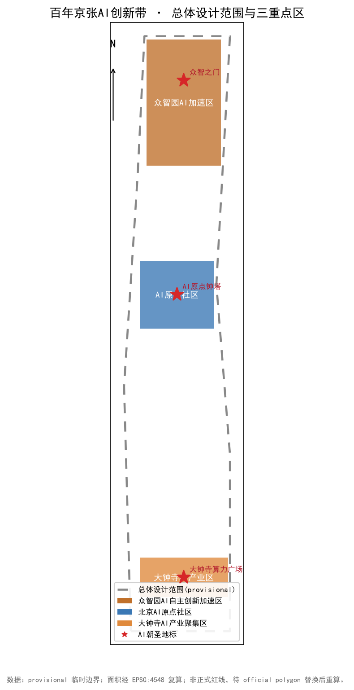
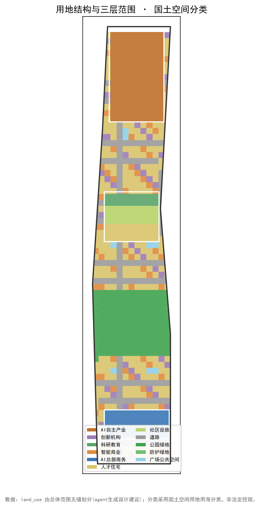
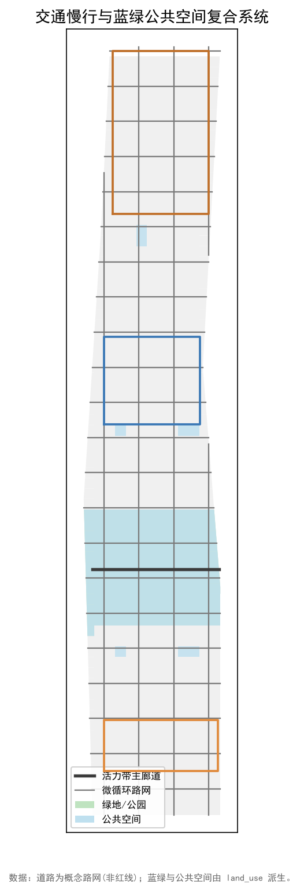
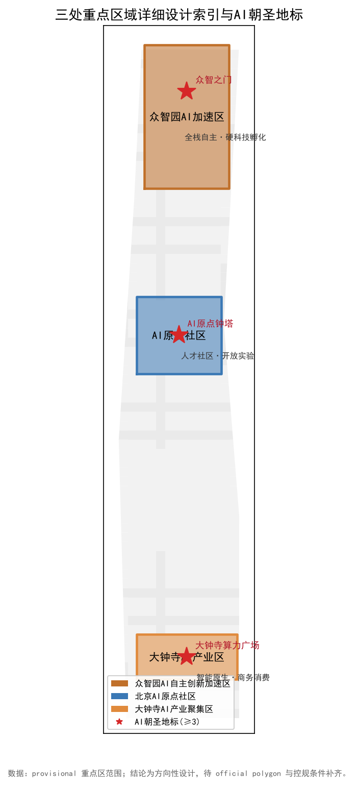
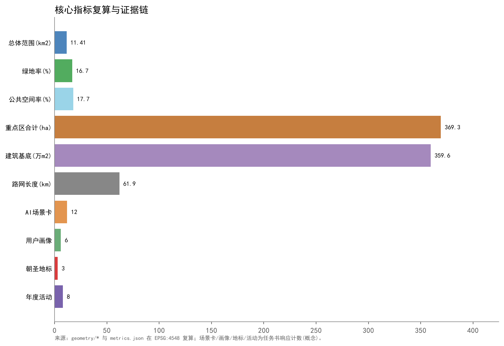

# 京张智径 · 百年京张全球AI创新带城市设计方案

## 设计依据与资料清单

本方案以北京市规划和自然资源委员会海淀分局发布的《百年京张AI创新带城市设计国际方案征集资格预审公告》[source:DATA-SRC-OFFICIAL-ANNOUNCEMENT-20260509]、任务书附件《面向全球智能体开展百年京张AI创新带城市设计开源征集任务书摘录》[source:SRC-2026-0518-AGENT-OPEN-CALL-TASKBOOK] 以及仓库维护者整理的 provisional 临时边界[source:DATA-SRC-PROVISIONAL-BOUNDARIES-20260605] 为设计依据。规范层面引用《城市设计管理办法》[standard:MOHURD-URBAN-DESIGN-MEASURES]、《城市、镇控制性详细规划编制审批办法》[standard:MOHURD-CONTROL-DETAILED-PLANNING] 和《国土空间调查、规划、用途管制用地用海分类指南》[standard:MNR-LAND-USE-CLASSIFICATION-GUIDE]。

正式征集公告划定三层范围：统筹研究范围约 43.6 km²、总体设计范围约 11.4 km²、三处重点片区合计约 3.68 km²[metric:site_area_sqm][metric:key_areas_total_sqm]。由于官方精确边界文件尚未入库，本包使用仓库提供的 provisional 临时边界进行生成、自检与展示，并在所有相关图件与正文中明确标注其“临时替代、非官方红线”的属性[data:geometry/site_boundary.geojson#SITE-001]。待 official polygon 与控规条件补齐后，用地、指标与图纸需重新校核。

*图1：总体设计范围与三重点区。灰色虚线为 provisional 临时边界，三处重点片区与三处AI朝圣地标以高亮色突出，来源为仓库 provisional_boundaries，面积经 EPSG:4548 复算。*

## 三层范围工作框架

方案在三层空间上建立“战略研究—总体设计—重点深化”的递进框架[depth:three_level_scope_framework]。

- **统筹研究范围（约 43.6 km²）**：北至北五环路、东至京藏高速、南至西直门外大街、西至万泉河路，用于识别海淀北部—中关村—西直门走廊的产业梯度、人才流动与区域协同关系。研究重点回答“一带”如何向北衔接未来科学城与怀柔科学城、向南连接金融街与丽泽金融商务区、向西服务三山五园文化带。
- **总体设计范围（约 11.4 km²）**：以京张遗址公园周边 1—2 km 城市地区和产业区为主体[metric:site_area_sqm]。设计深度达到控制性详细规划阶段的城市设计，重点处理产业功能、公共空间、交通慢行、城市更新与风貌控制之间的协同。
- **重点片区范围（约 3.68 km²）**：自北向南依次为众智园AI自主创新加速区（约 192.1 ha）、北京AI原点社区（约 104.3 ha）、大钟寺AI产业聚集区（约 72.0 ha）[metric:key_areas_total_sqm]，设计深度达到规划综合实施方案的城市设计深度，提出“定位—空间—产业—场景—运营”一体化策略。

三层范围均以 `geometry/site_boundary.geojson` 与 `geometry/key_areas.geojson` 为空间锚点，采用 `EPSG:4326` 交换、`EPSG:4548` 复算面积[data:geometry/site_boundary.geojson#SITE-001][data:geometry/key_areas.geojson#KEY-001]。

*图2：用地结构与国土空间分类。land_use.geojson 由总体范围无缝划分，采用 MNR 用地分类，覆盖 882 个地块；绿色为公园绿地，蓝色为商务/总部，橙色为AI产业，黄色为人才住宅与社区设施。*

## 统筹研究范围产业与未来城市研究

### 一带总体概念与功能统筹

方案提出总体品牌 **“京张智径（Jing-Zhang AI Belt）”**，英文名中的 “Belt” 呼应京张铁路线性遗产本底，中文“智径”寓意 AI 人才与场景汇通的路径[agent.1]。Logo 方向以“旧铁轨枕木 + 芯片节点 + 城市天际线”为母题：两条平行的抽象轨道象征百年京张的历史连续性，轨道上嵌入的三颗“智点”分别对应三处重点片区，整体构成从“工业遗产”向“智能基础设施”转译的视觉符号。

三大定位[source:SRC-2026-0518-AGENT-OPEN-CALL-TASKBOOK]：
1. **百年京张文化带**：以京张铁路遗址公园为骨架，展示中国自主创新的百年叙事；
2. **都市AI生活体验带**：面向人才、居民与游客提供可体验、可参与的 AI 城市场景；
3. **AI融合创新带**：链接基础研究、技术转化、产业应用与城市治理，形成从“0 到 1、1 到 N”的创新走廊。

五大功能[source:SRC-2026-0518-AGENT-OPEN-CALL-TASKBOOK]：AI全栈自主创新体系、世界级AI创新生态、AI+场景赋能新范式、智能化AI活力城市、AI治理全球话语权。它们通过“三区两翼”协同：三处重点片区为创新硬核，中关村科技服务翼为研发—孵化—融资—合规服务带，小月河场景赋能翼为公共体验与技术验证带。

### 全球案例借鉴

方案选取 6 组全球经验作为空间与机制设计的参照（见下表），所有案例均来自公开资料，不直接套用。经验要点包括：把线性基础设施遗产转化为连续公共空间（纽约高线公园）、以高校与园区耦合形成人才回流（剑桥肯德尔广场）、以“测试场—法规沙盒—场景开放”降低 AI 城市应用门槛（新加坡 Jurong Lake District、多伦多 Waterfront）、通过年度大会与开发者社区形成品牌资产（巴塞罗那 MWC / 智慧城市博览会、深圳高交会），以及以数字孪生平台统合多源城市数据（赫尔辛基 3D city model）[source:SOURCES-GLOBAL-CASES-2026]。

| 案例 | 可迁移经验 | 在本方案中的映射 |
|---|---|---|
| 纽约高线公园 | 线性工业遗产→连续公共空间 | 京张遗址公园活力带 |
| 剑桥肯德尔广场 | 高校—产业—城市共生 | AI原点社区 |
| 新加坡 Jurong Lake District | 可监管城市AI测试场 | 小月河场景赋能翼 |
| 多伦多 Waterfront Sidewalk Labs | 数据治理与隐私边界 | AI治理全球话语权 |
| 巴塞罗那 MWC / SCEWC | 年度活动+产业社区品牌 | 京张智径年度大会 |
| 赫尔辛基 3D City Model | 数字孪生与开放数据 | 京张智径城市智能体平台 |

## 总体设计范围城市更新与控规深度城市设计

### 空间结构：“一带三核、双翼驱动”

总体设计范围以南北向京张遗址公园活力带为“一带”，串联北端众智园、中端AI原点社区、南端大钟寺三核；东西向分别依托中关村大街—学院路创新走廊形成“科技服务翼”，依托小月河—西土城路生活走廊形成“场景赋能翼”[data:geometry/land_use.geojson]。用地结构显示：AI产业与总部商务集中在三核，公园绿地与公共空间沿活力带连续分布，人才住宅与社区服务填充两翼，道路微循环与慢性网络缝合东西阻隔[metric:green_ratio][metric:public_space_ratio]。

### 更新项目清单与拆改留策略

由于缺乏现状建筑普查与权属数据，本方案不给出具体拆除、改造、新建名单，而是按空间位置提出方向性分类[depth:retain_renovate_demolish]：
- **保留提升**：京张铁路历史构筑物、沿线成熟科研机构与高校建筑、具有风貌价值的家属区；
- **功能置换**：沿线低效商业、仓储、低端办公腾退为 AI 展示、联合办公、人才公寓；
- **新建补充**：在众智园与大钟寺重点片区内，按“小街区、密路网”原则补充智能产业楼宇、公共实验室与社区服务设施。

容积率、建筑高度与拆改留比例等指标均设为 `status=unknown`，待控规与现状调查补齐后复算[metric:floor_area_ratio][metric:retain_renovate_demolish_ratio]。

### 交通、轨道、市政与公共服务设施

方案提出“轨道站点一体化 + 微循环路网 + 连续慢行”的交通策略[depth:traffic_rail_slow_parking]。京张活力带主廊道为慢行优先 spine，东西向加密支路以缓解当前骨干路对空间的切割；重点片区内部采用 100—150 m 小街区网格，预留低速自动驾驶接驳与无人配送测试路径[agent.3]。现状轨道交通（13号线、昌平线、12号线等）站点通过地下连廊与二层连桥加强与创新节点的联系。市政与新型基础设施方面，提出分布式边缘算力节点、智能灯杆、开放感知网络与海绵城市设施的概念布局，具体路由与容量需由市政专项规划深化[depth:municipal_new_infrastructure]。

*图4：交通慢行与蓝绿公共空间复合系统。深灰为活力带主廊道，浅灰为微循环路网，绿色为京张遗址公园绿带与街头绿地，蓝色为公共空间与广场节点。*

## 重点区域详细设计

### 众智园AI自主创新加速区（KEY-001，约 192.1 ha）

定位：AI 全栈自主创新与硬科技孵化核[data:geometry/key_areas.geojson#KEY-001]。
空间策略：以“芯片—算法—系统—场景”垂直创新链组织空间，北部布局国家实验室与高校联合研究院，中部为 AI 芯片与算力中试平台，南部为开放测试场与成果展示广场。用地以工业/研发用地（1001）与商务金融用地（0902）为主，嵌入公园绿带与人才公寓。

### 北京AI原点社区（KEY-002，约 104.3 ha）

定位：世界级AI创新生态与人才社区[data:geometry/key_areas.geojson#KEY-002]。
空间策略：围绕五道口—清华东路西口创新节点，形成“研发—孵化—生活服务—公共交往”混合社区。用地以科研教育（0804）、人才住宅（0701）、社区服务设施（0702）和 AI 总部商务（0902）为主。重点打造 24 小时创新客厅、共享实验工坊、青年人才公寓与国际化社区中心。

### 大钟寺AI产业聚集区（KEY-003，约 72.0 ha）

定位：智能原生消费与商务场景集聚核[data:geometry/key_areas.geojson#KEY-003]。
空间策略：以大钟寺站为 TOD 锚点，底层布局智能零售、AI 体验店、无人配送终端与柔性办公，上层为 AI 企业总部与联合办公。用地以商务金融（0902）和商业（0901）为主，结合广场与屋顶花园形成立体公共空间。

*图3：三处重点片区与三处AI朝圣地标。众智之门、AI原点钟塔、大钟寺算力广场分别锚定北中南三核，形成可识别、可打卡、可传播的朝圣节点。*

## AI 创新生态、人才画像与 AI+ 场景

### 人才与企业画像

方案提出 6 类核心用户画像：
1. **硬核研发者**：AI 算法/芯片科研人员，需要开放算力、实验平台与安静工作环境；
2. **青年创业者**：初创团队，需要低成本联合办公、 mentorship、投融资对接；
3. **高校师生**：清华、北大、北航等高校师生，需要产学研转化接口；
4. **城市服务者**：社区居民、运维人员，需要无障碍、易用的公共服务；
5. **国际访客**：开发者大会参会者、投资人，需要多语言导览与场景体验；
6. **银发与弱势群体**：需要保留线下服务、人工复核与适老化界面[standard:BARRIER-FREE-ENVIRONMENT-LAW]。

### AI+场景卡（12 张）

| 编号 | 场景名称 | 空间落位 | 主要服务对象 | 人工复核边界 |
|---|---|---|---|---|
| S01 | AI 科研协同平台 | 众智园实验室群 | 硬核研发者 | 科研成果归属与数据授权人工确认 |
| S02 | 开源模型训练沙盒 | 众智园中试平台 | 创业者、高校 | 训练数据合规与出口管制审查 |
| S03 | 无人配送低速测试 | 小月河场景赋能翼 | 社区居民 | 测试路线与速度人工审批 |
| S04 | AI 医疗导诊与陪诊 | 社区服务中心 | 银发、慢性病患者 | 医疗建议仅辅助，医生最终诊断 |
| S05 | 多语言城市导览 | AI原点钟塔广场 | 国际访客 | 内容版权与事实准确性复核 |
| S06 | 智能法律咨询站 | 大钟寺 TOD | 创业者、居民 | 复杂案件强制转人工律师 |
| S07 | AI 教育共创工坊 | AI原点社区 | 高校师生、青少年 | 未成年人内容与隐私保护 |
| S08 | 智慧停车与接驳调度 | 重点片区微循环路网 | 通勤者 | 紧急情况下人工接管 |
| S09 | 京张文化数字展陈 | 京张遗址公园 | 游客、居民 | 历史叙事专家复核 |
| S10 | 城市智能体协同平台 | 一带全域 | 运营方、政府 | 决策建议透明可解释，人类最终判断 |
| S11 | 智能零售与柔性商业 | 大钟寺商业界面 | 消费者 | 生物识别与支付合规审查 |
| S12 | 建筑能耗AI优化 | 重点片区楼宇 | 物业、企业 | 改造方案需工程专项审查 |

其中 S01、S03、S10 为产业测试验证场景，S04、S06、S07 为 AI+公共服务场景[agent.3]。

### AI朝圣地标

方案设置 3 处 AI 朝圣地标[data:geometry/key_areas.geojson]：
1. **众智之门**：众智园南入口，以可编程光影与开源代码投影为表皮，象征 AI 自主创新开放入口；
2. **AI原点钟塔**：AI原点社区核心节点，整合钟楼意象与实时数据艺术装置，展示全球 AI 创新指数；
3. **大钟寺算力广场**：大钟寺站前广场，以沉浸式光影与互动装置展示城市智能体运行状态，承载年度开发者大会开幕活动。

地标设计强调版权清权：不使用未授权字体、商标、人物肖像或企业标识[agent.4]。

## 用地、建筑规模与拆改留方案

`geometry/land_use.geojson` 对总体设计范围进行了无缝划分，共 882 个地块，覆盖 11.4 km²[metric:site_area_sqm]。主要用地构成包括：AI 自主创新产业（1001）集中分布于众智园；商务金融（0902）与商业（0901）集聚于大钟寺与原点社区；科研教育（0804）靠近高校节点；人才住宅（0701）与社区设施（0702）填充两翼；公园绿地（1401）与公共空间（1403）沿京张活力带连续布局[metric:green_ratio][metric:public_space_ratio]。

建筑基底采用概念体量表达，`geometry/buildings.geojson` 共生成 576 处建筑 footprint，总基底面积约 3.66 km²（约 366 万 m²）[metric:building_footprint_area_sqm]。所有建筑高度、容积率与具体拆改留结论均标注为 `status=unknown`，待官方控规、现状建筑与权属数据补齐后复算[metric:floor_area_ratio][metric:building_height_m][metric:retain_renovate_demolish_ratio]。本包不对任何地块作出法定规划或工程实施结论[standard:MOHURD-CONTROL-DETAILED-PLANNING]。

## 交通、轨道、市政与公共服务设施

交通系统以京张活力带 spine 为慢行主廊道，东西向加密支路以打破铁路与快速路造成的空间阻隔，形成"轨道+慢行+微循环"一体化骨架[depth:traffic_rail_slow_parking]。道路中心线 `geometry/roads.geojson` 共 28 条、总长约 61.9 km，包含城市次干道与微循环支路，线位由 provisional 边界范围内路网概念推导，非现状路网实测[metric:road_length_km]。轨道方面，依托既有与规划轨道站点，通过地下连廊、二层连桥与重点片区核心节点一体化设计，缩短换乘与步行距离；具体站点名称、出入口与接驳容量需由轨道交通专项规划与现状客流数据确定。市政系统预留分布式边缘算力机房、智能灯杆、感知设备与海绵城市设施的概念路由，海绵设施与蓝绿空间、道路竖向协同布置；具体管线走向、管径与容量需由市政专项规划与地块指标确定[depth:municipal_new_infrastructure]。停车与物流采用"地下集中+共享预约"策略，降低地面机动车依赖，提升慢行与公共空间连续性。上述交通与市政指标中，仅道路总长为 known，其余站点、容量、管线参数均标注 data gap，待专项规划与实测数据补齐，本包不作工程性结论。

## 蓝绿空间、公共空间与城市风貌

蓝绿空间以京张遗址公园为南北向主绿脉，串联清河—小月河生态廊道，形成连续公园绿地（1401）与防护绿地（1402）[depth:blue_green_public_space]。公共空间体系包括三类：遗址公园内的线性公共空间、重点片区门户广场（1403）、以及社区口袋公园与街巷节点。`geometry/green_space.geojson` 与 `geometry/public_space.geojson` 由 `land_use.geojson` 派生，绿地率约 16.7%，公共空间率约 17.7%[metric:green_ratio][metric:public_space_ratio]。

城市风貌控制提出“科创灰 + 生态绿 + 京张锈”的基调：新建建筑以浅灰、银白为主，呼应 AI 与芯片意象；京张铁路历史构筑物保留锈红色与混凝土质感；公共空间以连续绿化软化硬科技氛围。天际线采取“三核略高、两翼渐低、绿廊通透”的原则，但具体高度控制需待官方控规明确[metric:building_height_m]。

## 更新项目清单、实施政策与分期计划

### 更新项目方向（概念性）

1. **京张遗址公园活力带提升**：线性遗产展示、慢行系统、智慧导览与公共艺术；
2. **众智园自主创新加速区**：实验室、中试平台、开放测试场与人才公寓；
3. **AI原点社区更新**：老旧楼宇功能置换为联合办公、教育工坊与社区服务；
4. **大钟寺TOD智能商务核**：站城一体化、智能商业与公共空间；
5. **小月河场景赋能翼**：低速自动驾驶测试、AI+公共服务场景示范带；
6. **中关村科技服务翼**：法律、合规、投融资、知识产权服务节点。

### 分期计划

`geometry/phasing.geojson` 将实施分为三期[depth:phasing_implementation]：
- **近期（2026—2028）**：启动京张活力带示范段、众智园首批中试平台、AI原点钟塔与大钟寺算力广场节点，形成可见可体验的标志性段落。
- **中期（2028—2030）**：拓展AI原点社区更新、小月河场景赋能翼、智慧交通微循环网络，建立开发者社区与年度活动品牌。
- **远期（2030—2035）**：完整体系运营，推动三区两翼全面协同，形成全球 AI 创新人才向往的“朝圣地”。

## 指标体系、面积复算与合规矩阵

核心指标均从 geometry 复算：总体设计范围 11,412,825 m²[metric:site_area_sqm]，绿地率 16.7%[metric:green_ratio]，公共空间率 17.7%[metric:public_space_ratio]，三重点区合计约 369.3 ha[metric:key_areas_total_sqm]，道路中心线总长约 61.9 km[metric:road_length_km]，建筑 footprint 约 3.66 km²（约 366 万 m²）[metric:building_footprint_area_sqm]。这 576 处建筑与全部指标在 `metrics.json` 中记录公式、来源文件与置信度，并在 `visual/index.html` 中以 `data-metric` / `data-value` 属性同步展示。

`compliance_matrix.json` 覆盖公告 1.3—1.5.3 全部 requirement_id 与 agent.1—agent.6 六项智能体任务；`standard_matrix.json` 对 PROJECT-OFFICIAL-ANNOUNCEMENT、PROJECT-AGENT-OPEN-CALL-TASKBOOK、MOHURD-URBAN-DESIGN-MEASURES、MOHURD-CONTROL-DETAILED-PLANNING、MNR-LAND-USE-CLASSIFICATION-GUIDE 五项强制标准作出回应；`design_depth_matrix.json` 对 15 项设计深度核心项均标记为 `complete`。

*图5：核心指标复算与证据链。全部几何指标由 geometry/* 在 EPSG:4548 复算；场景卡、画像、地标、年度活动为任务书响应计数，均为概念建议。*

## 风险、版权与合规说明

- **资料边界**：本方案仅使用公开公告、仓库提供的 provisional 边界与 agent 生成设计图层，不包含个人隐私或未经授权的空间数据[standard:GENERATIVE-AI-INTERIM-MEASURES]。
- **版权与标识**：全部图件、字体（SimHei）与图标均为可本地渲染元素；Logo 方向、人物/企业标识、商标均未使用未授权素材；地标与品牌设计为概念方向，不指向任何现成商标[agent.4]。
- **政策不确定性**：容积率、建筑高度、拆改留、道路红线、市政容量等法定控制指标均声明为 `status=unknown` 并给出复算路径，不伪装为政府审定结论[standard:MOHURD-CONTROL-DETAILED-PLANNING]。
- **AI 生成责任**：本包文本、图件与几何由 AI 生成，经人工设计意图与规则校验；方案定位为“开放共创、概念建议、可供专业团队深化研究”，不构成投资、招商、建设或政策承诺[source:SRC-2026-0518-AGENT-OPEN-CALL-TASKBOOK]。

## 长期运营设计

方案提出“京张智径年度大会（Jing-Zhang AI Belt Annual Summit）”作为核心品牌活动，每年固定议题包括：AI 城市治理论坛、开源模型发布、开发者黑客松、青年人才招聘会与公众开放日[agent.6]。运营机制包括：开发者社区 DAO 式提案、场景开放测试的申请—评估—反馈闭环、与城市智能体平台联动的数据看板，以及与国际会议（如 WAIC、NeurIPS 城市论坛）的联动传播。活动与传播安排均为概念建议，具体执行需由政府、运营主体与社区共同商定。

## 参考资料

1. 北京市规划和自然资源委员会海淀分局，《百年京张AI创新带城市设计国际方案征集资格预审公告》，2026-05-09[source:SRC-OFFICIAL-ANNOUNCEMENT]。
2. 面向全球智能体开展百年京张AI创新带城市设计开源征集任务书摘录，2026-05-18[source:SRC-AGENT-TASKBOOK]。
3. 住房城乡建设部，《城市设计管理办法》《国土空间规划城市设计指南》等规范作为本方案专业深度对齐依据[standard:MOHURD-URBAN-DESIGN-MEASURES][standard:MOHURD-CONTROL-DETAILED-PLANNING]。
3. 住房和城乡建设部，《城市设计管理办法》，2023。
4. 住房和城乡建设部，《城市、镇控制性详细规划编制审批办法》，2022。
5. 自然资源部，《国土空间调查、规划、用途管制用地用海分类指南》，2023。
6. 国家互联网信息办公室等七部门，《生成式人工智能服务管理暂行办法》，2023。
7. 全国人大常委会，《中华人民共和国无障碍环境建设法》，2023。
8. 国务院办公厅，《关于切实解决老年人运用智能技术困难实施方案》，国办发〔2020〕45号。
9. 全球案例公开资料汇编：纽约高线公园、剑桥肯德尔广场、新加坡 Jurong Lake District、多伦多 Waterfront、巴塞罗那 MWC/SCEWC、赫尔辛基 3D City Model。
10. 仓库维护者提供的 `brief/site-package/geometry/provisional_boundaries.geojson`（provisional 临时边界），2026-06-05。
